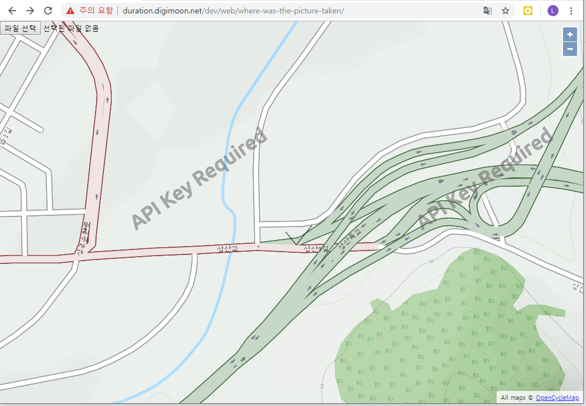

# Where-was-the-picture-taken

Where was the picture taken :: 사진은 어디에 찍힌걸까?

## Info

사진을 서버에 저장하지 않고 사진의 위치 정보를 뽑아 어디에서 찍은 사진인지 알려줍니다.

[여기](http://duration.digimoon.net/dev/web/where-was-the-picture-taken/)에서 해보실 수 있습니다.

작동하지 않는 경우 여러번 시도하시면 됩니다.

## Library List

1. jQuery
2. Openlayers
3. jsOLExt
4. exif-js

## Copyright

- 비상업적 용도로 사용 가능하며 링크를 반드시 포함해주세요.
- 문제가 되는 내용이 있다면 언제든지 [`issue`](https://github.com/Sotaneum/Where-was-the-picture-taken/issues/new), [`Pull requests`](https://github.com/Sotaneum/Where-was-the-picture-taken/compare) 부탁드립니다.

